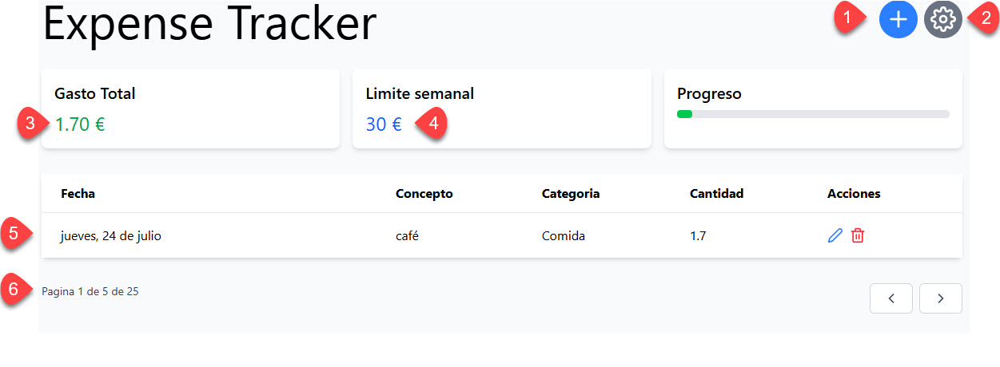
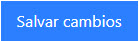

# Estados

| #  | Name              | Detalle                                                       |
|----|-------------------|---------------------------------------------------------------|
| 1  | createExpenseBtn  | Llama a: `createNewExpense`                                   |
| 2  | showSettingsBtn   | Muestra y oculta la ventana `setIsOpenSettings(!isOpenSettings)` |
| 3  | totalWeekExpense  |                                                               |
| 4  | weeklyLimit       | Estado. Se obtiene en `getData`                               |
| 5  | expenses          |                                                               |
| 6  | pagination        |                                                               |

---

## Botones de acción

| Botón              | ID                  | Función                         |
|--------------------|---------------------|----------------------------------|
|                    | editExpenseButton    | `editExpense(expense._id)`       |
|                    | deleteExpenseButton  | `deleteExpense(expense._id)`     |
| saveExpense        |                     | `saveExpense(expense)`          |
| cancelExpenseEdit  |                     | `cancelEditExp`                 |

### Pantalla de configuración
## Botones de acción

| Botón                                               | ID                    | Función                         |
|-----------------------------------------------------|-----------------------|---------------------------------| 
|   | saveChangesBtn    | `saveChange`       |

---

## Toast (Notificaciones)
  

`showError` -> Muestra una notificacion de error con el mensaje indicado. 
`successNotification` -> Muestra una notificacion de éxito con el mensaje indicado. 